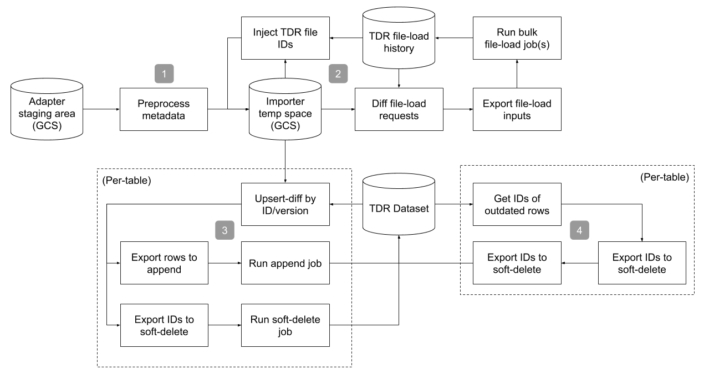

# HCA Ingest
Batch ETL workflow for ingesting HCA data into the Terra Data Repository (TDR).

## Status: MVP
There's a good chance that this entire repository will need to be rewritten / thrown
away after the MVP of DCP 2.0.

## Schema Design
The MVP schema for HCA is purposefully minimal. Instead of fully replicating the
existing [metadata schemas](https://github.com/humancellatlas/metadata-schema), we've
set up a generic, flexible scheme for capturing arbitrary metadata. There is a table
per "concrete" HCA entity type (see [here](https://github.com/HumanCellAtlas/metadata-schema/tree/master/json_schema/type)),
as well as for `links.json` connections. Each table has at least three columns:
1. An `{entity_type}_id` containing the document ID
2. A timestamp `version`
3. `content`, containing the string-encoded JSON metadata document

The tables for metadata describing data files have a few additional columns:
1. `file_id`, containing the TDR-generated ID of the linked data file
2. `descriptor`, containing "system" properties of the data file (i.e. size, checksum),
   string-encoded as a JSON object

The only explicit foreign-key reference between tables in the schema is from the `links`
table to the `project` table. All other references can be found in the `content` of rows
in the `links` table.

## Pipeline Architecture
HCA Ingest doesn't run on a schedule / automatically. Instead, an Argo workflow template
must be manually launched through the CLI or UI. Once kicked off, the workflow orchestrates
Dataflow, BigQuery, and TDR data-processing jobs to push data into the repository. The high
level flow looks like:

The four main steps are:
1. Pre-process documents into (mostly) our target schema
2. Ingest data files
3. Ingest metadata
4. Clean up old metadata

### Step 0: Receiving Data
Unlike many of our other ingest pipelines, the HCA ingest workflow is not responsible
for pulling data from external source systems. Instead, our collaborators in the project
run "adapter" programs to push / upload data into a GCS bucket, following a common exchange
format. Under some prefix, the format requires:
* Metadata documents must be named like `metadata/{entity_type}/{entity_id}_{version}.json`
* File descriptors must be named like `descriptors/{entity_type}/{entity_id}_{version}.json`
  * The `entity_id` and `version` pair are expected to also be present under `metadata/`
* Data files must be named like `data/{file_name}`
  * The `file_name` value is expected to be found within some JSON under `descriptors/`
* Links subgraphs must be named like `links/{links_id}_{version}_{project_id}.json`
  * The `project_id` value is expected to be present under `metadata/`

### Step 1: Preprocessing Metadata
Assuming the common exchange format, we run a Dataflow pipeline to transform individual JSON
documents under `metadata/` into our target TDR schema, outputting the result as BigQuery-
friendly JSON list. We do some extra work in this step:
1. Parse IDs / versions from file names, injecting the values into output rows
2. Join descriptor JSONs to metadata by ID / version
3. Generate candidate TDR bulk-load requests for data files

The metadata produced by this step for non-file entities is immediately valid for ingest
into the TDR. File metadata is missing the `file_id` column, which is injected as part of the
next step in the orchestration workflow.

### Step 2: Ingesting Data Files
It's possible that the importer will be run multiple times on the same subset of data. In this
case, we need to prevent repeated re-ingest of data files. We do this by:
1. Using the crc32c of files as their "virtual path" within the TDR
2. LEFT JOIN-ing generated bulk-file requests against the `datarepo_load_history` table in the TDR,
   filtering out all rows in which the JOIN succeeds

Rows that survive the SQL filter are valid for ingest. We submit the outputs to the TDR in bulk
file-load requests, and poll the jobs to completion. Once all data files have been ingested, we use
a final BigQuery JOIN / export combo between staged file metadata and the `datarepo_load_history`
table to inject `file_id` values into staged metadata.

### Step 3: Ingesting Metadata
To push metadata into the TDR, we follow a common pattern per-table:
1. Diff staged metadata against the state of the TDR
2. Export rows-to-append and ids-to-delete from the diff outputs
3. Run a TDR soft-delete job, followed by a TDR ingest job, using the exported data

The templates used to run these steps are generic, and abstracted across ingest projects.
We had to make two additions to these templates to support the HCA use-case:
1. To support importing from multiple transient staging areas, none of which contain the entirety
   of HCA metadata, we added the ability to compute an "upsert" diff instead of a full diff, only
   producing soft-delete IDs for updates
2. To prevent re-ingestion of soft-deleted rows, we added the ability to diff against the "raw"
   TDR table instead of the live view

After this step completes, the TDR's tables will contain the latest data for every ID/version pair
found in the original staging area.

### Step 4: Cleaning Metadata
The first three steps of the importer will ensure that all ID/version pairs found in a staging area
are synced into the TDR, along with any linked data files. This isn't _quite_ enough to cut a snapshot,
however, because it's possible that multiple versions for the same document ID will end up "live"
within the dataset.

To ensure that HCA snapshots only ever contain the latest version of each document, the final step
of the importer uses BigQuery jobs to detect and export the TDR IDs of "outdated" rows. It then
soft-deletes those IDs. Once the step completes, the dataset will be in a valid state for a "full view"
snapshot.
    